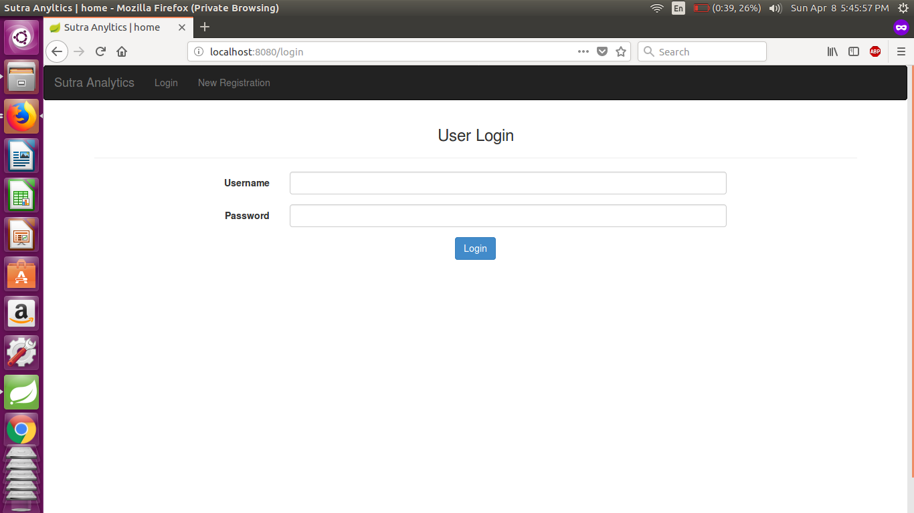
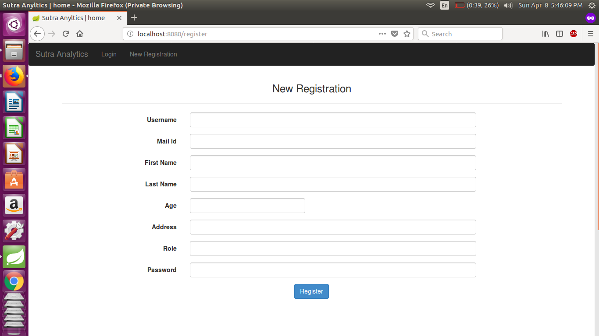
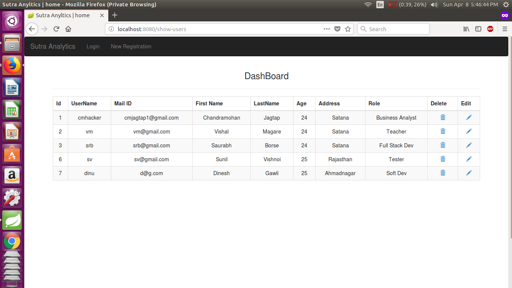

# Spring Boot Login Application (Sutra Analytics Assignment)

#### AUTHOR:

- [Chandramohan Jagtap](https://github.com/cmjagtap "Chandramohan's github profile")

#### DESCRIPTION:

	The task is given by Sutra Analytics, As per requirement i have implemented Login, Registration and user dashboard. 

#### BUILDING AND USING:

- ##### Technology:

	Java Spring Boot (Backend) 
	Mysql (Database)
	Jsp (Frontend)
	
- ##### Task done:

	Login validation from mysql database.
	Register new user and store data into database.
	After login dashboard created.
	Login user can update records.
	User can delete account.

- ##### Build:

  First you need to set up database details in file `/src/main/resources/application/.properties`.
  Install `Maven` dependancies using terminal type `mvn clean install` from root directory of 		project 

- ##### Executing the application (run the server):
  
  Type `mvn spring-boot:run` on terminal to execute application. 
  then open browser and navigate to `http://localhost:8080/welcome`

- ##### Clean project:
  
	Enter `mvn clean` to remove all the object files and the final executable.
  
